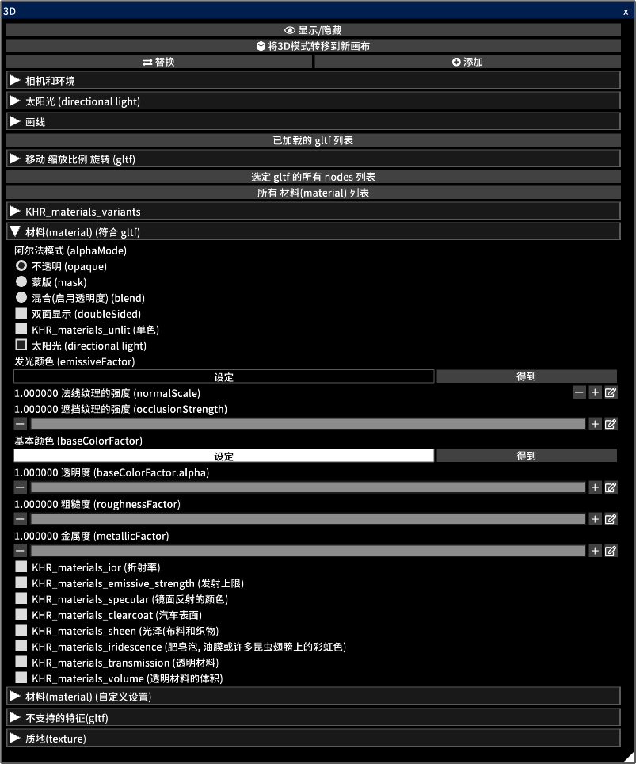

---
hide:
  - toc
---

<!-- https://steamcommunity.com/sharedfiles/filedetails/?id=2964322434 -->

您可以打开 gltf 和 glb 文件中的 3D 模型  
您可以将 3D 外观原样转移到 2D 画布上  
您还可以将 3D 艺术线条转移到 2D 画布上  
您可以使用传输的画布来创建您的插图。例如, 将其用作插图的背景

3D 模型可以在 [blender](https://www.blender.org/) 或 Autodesk Maya 等 3D 软件中创建  
您还可以从 [sketchfab](https://sketchfab.com/) 等网站下载 3D 模型

单击 __"替换"__ 按钮将删除所有以前加载的 3D 模型, 只保留新加载的 3D 模型  
您可以通过单击 __"添加"__ 按钮来添加 3D 模型

您可以通过单击 __"已加载的 gltf 列表"__ 从多个加载的 gltf 中选择一个 gltf  
您可以移动/旋转/缩放选定的 gltf

您可以通过单击 __"选定 gltf 的所有 nodes 列表"__ 来选择所选gltf 中的 nodes (对象)  
您可以移动/旋转/缩放所选 nodes

您可以通过单击 __"所有 材料(material) 列表"__ 来选择所选 gltf 中的材料  
您可以调整所选材料的参数

__"材料(material) (符合 gltf)"__ 部分根据 gltf 规范列出了材料参数  
使用 blender 等 3D 软件创建的 3D 模型反映在 "材料(material) (符合 gltf)" 项目的参数中  
[检查此站点以在搅拌机中保存 gltf](https://docs.blender.org/manual/en/latest/addons/import_export/scene_gltf2.html#gltf-2-0)

从 [sketchfab](https://sketchfab.com/) 等网站下载的 3D 模型在 sketchfab 中的外观可能与在 icpaint 中的外观不同  
在这种情况下, 启用 KHR_materials_unlit (单色) 可能会产生相同的外观

* 加载 gltf 或 glb 文件时, 所有材质都启用 "太阳光 (directional light)" 。 您可以在导入后取消选中 "太阳光 (directional light)" 复选框
* 不支持点光源和聚光灯 (point light, spot light) (KHR_lights_punctual)
* 不支持 3D 模型的动画
* 不支持发光颜色 (emissiveFactor) 等光照
* 它不支持为 3D 模型投射阴影
* 不支持 KHR_draco_mesh_compression, EXT_meshopt_compression, KHR_mesh_quantization
* 不支持 ktx2 (图像格式) (KHR_texture_basisu)

[检查此站点以了解如何使用文本编辑器编辑 gltf](https://github.com/KhronosGroup/glTF-Tutorials/blob/master/AddingMaterialExtensions/AddingMaterialExtensions_002_UsingVisualStudioCode.md#using-visual-studio-code)

__"材料(material) (符合 gltf)"__ 部分的参数官方描述为:

* [gltf 的规范](https://registry.khronos.org/glTF/specs/2.0/glTF-2.0.html)
* [阿尔法模式的描述 (alphaMode)](https://registry.khronos.org/glTF/specs/2.0/glTF-2.0.html#alpha-coverage)
* [双面显示的描述 (doubleSided)](https://registry.khronos.org/glTF/specs/2.0/glTF-2.0.html#double-sided)
* [KHR_materials_unlit (単色)](https://github.com/KhronosGroup/glTF/tree/main/extensions/2.0/Khronos/KHR_materials_unlit#khr_materials_unlit)
* [材料 (material) 基本描述](https://github.com/KhronosGroup/glTF-Tutorials/blob/master/gltfTutorial/gltfTutorial_010_Materials.md#materials)
* [KHR_materials_ior (折射率)](https://github.com/KhronosGroup/glTF/tree/main/extensions/2.0/Khronos/KHR_materials_ior#khr_materials_ior)
* [KHR_materials_emissive_strength (发射上限)](https://github.com/KhronosGroup/glTF/tree/main/extensions/2.0/Khronos/KHR_materials_emissive_strength#khr_materials_emissive_strength)
* [KHR_materials_specular (镜面反射的颜色)](https://github.com/KhronosGroup/glTF/tree/main/extensions/2.0/Khronos/KHR_materials_specular#khr_materials_specular)
* [KHR_materials_clearcoat (汽车表面)](https://github.com/KhronosGroup/glTF/tree/main/extensions/2.0/Khronos/KHR_materials_clearcoat#khr_materials_clearcoat)
* [KHR_materials_sheen (光泽(布料和织物))](https://github.com/KhronosGroup/glTF/tree/main/extensions/2.0/Khronos/KHR_materials_sheen#khr_materials_sheen)
* [KHR_materials_iridescence (肥皂泡, 油膜或许多昆虫翅膀上的彩虹色)](https://github.com/KhronosGroup/glTF/tree/main/extensions/2.0/Khronos/KHR_materials_iridescence#khr_materials_iridescence)
* [KHR_materials_transmission (透明材料)](https://github.com/KhronosGroup/glTF/tree/main/extensions/2.0/Khronos/KHR_materials_transmission#khr_materials_transmission-)
* [KHR_materials_volume (透明材料的体积)](https://github.com/KhronosGroup/glTF/tree/main/extensions/2.0/Khronos/KHR_materials_volume#khr_materials_volume)
