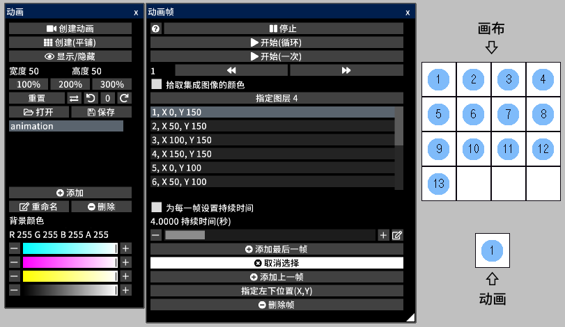
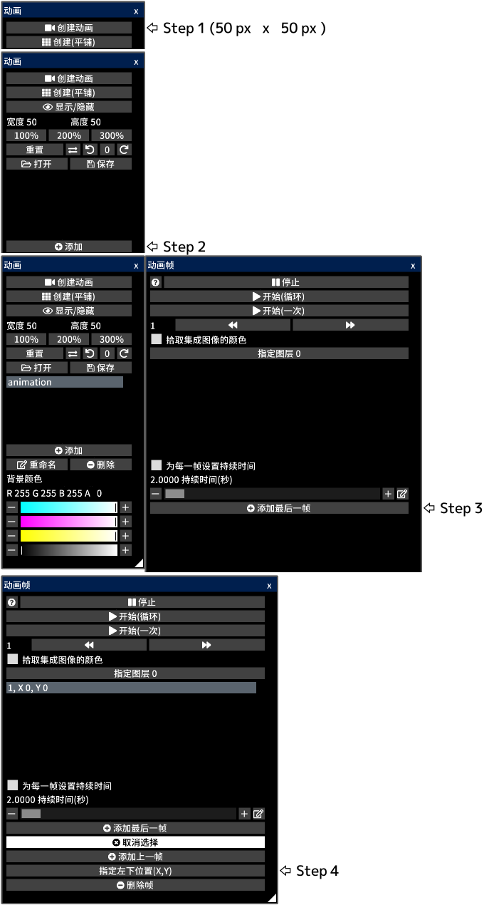
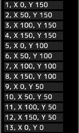
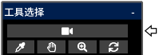

---
hide:
  - toc
---

<!-- https://steamcommunity.com/sharedfiles/filedetails/?id=2963161824 -->

动画通过每帧连续切换图像来表达运动

每一帧都是画布中的某个区域(矩形)  
所有帧都显示在画布中

当您打开动画 gif 或 webp 文件时, 会创建画布并准备好播放动画  
但是, 如果画布尺寸太大, 则不会创建动画

例如, 在这个画布中, 动画的每一帧都是一个正方形区域, 数字从 1 到 13  
当您播放动画时, 它将播放如下

### 如何制作动画

首先, 创建一个看起来像这样的画布  
接下来, 通过单击 "画布" 菜单中的 "动画窗口" 按钮打开 "动画" 窗口

您创建了 13 个帧

您可以指定每一帧的左下角位置  
__"1, X 0, Y 150"__ 表示第一帧左下位置为 (0, 150)  
画布的左下角位置是 (0, 0)  
在此示例中, 每个帧的宽度和高度均为 50 px  
选择一个帧后, 画布中会显示一个蓝色矩形框

如果选中 __"拾取集成图像的颜色"__ 复选框, 则动画将以当前画布外观播放  
如果关闭此复选框, 则将仅以指定层的外观播放动画

动画将通过点击 __"开始"__ 按钮来播放  
您可以通过选择动画工具更改播放的动画的位置和大小

您可以将动画保存为 gif 或 webp 文件  
由于 gif 文件的颜色数量有限, 因此只有在选择像素画图层时才能另存为 gif 文件  
在这种情况下, 您需要在像素画图层中绘制动画
