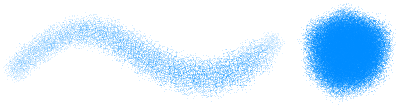
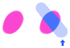
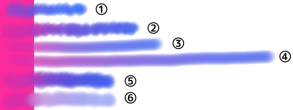

---
hide:
  - toc
---

<!-- https://steamcommunity.com/sharedfiles/filedetails/?id=2966152789 -->

喷漆

・ 较软  
・ 间距 0.5  
・ 大小 50  
・ 不透明度 20%  
・ 最小尺寸 100  
・ 最小不透明度 30%

---

・ 柔软  
・ __间距 0.1__  
・ 大小 8  
・ 不透明度 50%  
・ 最小尺寸 0  
・ 最小不透明度 0%

---

・ 坚硬  
・ __间距 2.0__  
・ 大小 14  
・ 不透明度 100%  
・ 最小尺寸 0  
・ 最小不透明度 100%

---

・ __画笔圆形图像 (star.tga)__  
・ 间距 2.0  
・ 大小 14  
・ 不透明度 100%  
・ 最小尺寸 0  
・ 最小不透明度 100%

---

・ 坚硬  
・ 间距 2.0  
・ 大小 14  
・ 不透明度 100%  
・ 最小尺寸 0  
・ 最小不透明度 100%  
・ __画笔基础纹理 (tex.tga)__

---

・ __画笔圆形图像 (star.tga)__  
・ 间距 2.0  
・ 大小 18  
・ 不透明度 100%  
・ 最小尺寸 0  
・ 最小不透明度 100%  
・ __画笔基础纹理 (tex.tga)__

---

・ __画笔圆形图像 (img.tga)__  
・ 间距 1.0  
・ 大小 35  
・ 不透明度 100%  
・ 最小尺寸 40  
・ 最小不透明度 40%  
・ 随机角度 179°

---

・ 较软  
・ 间距 0.3  
・ 大小 20  
・ 不透明度 60%  
・ 最小尺寸 70  
・ 最小不透明度 20%  
・ __画笔基础纹理 (tex.tga)__

---

・ 较软  
・ 间距 0.3  
・ 大小 20  
・ 不透明度 60%  
・ 最小尺寸 70  
・ 最小不透明度 20%  
・ __画笔基础纹理 (circle.png)__  
・ 缩放比例 30% (画笔基础纹理)

circle.png

---

・ 坚硬  
・ 间距 2.0  
・ 大小 18  
・ 不透明度 100%  
・ 最小尺寸 0  
・ 最小不透明度 100%  
・ __椭圆 40%__  
・ 角度 0°

---

・ 坚硬  
・ 间距 2.0  
・ 大小 18  
・ 不透明度 100%  
・ 最小尺寸 0  
・ 最小不透明度 100%  
・ __椭圆 40%__  
・ __角度 130°__

---

如果工具窗口最上面的按钮是 "__马克笔__" , 它会被替换成颜色

---

如果工具窗口最上面的按钮是 "__模糊(平均色)__" , 就会用画笔圈内的绘图的平均颜色来绘制  
如果选中 "__拾取集成图像的颜色__" 复选框, 则根据画布的当前外观确定平均颜色  
如果清除此复选框, 则根据当前图层上绘制的内容确定平均颜色

---

如果工具窗口最上面的按钮是 "__混合器__"

① 混色 70,  延伸色 70, 水的数量 10  
② 混色 90,  延伸色 70, 水的数量 10  
③ 混色 90,  延伸色 0, 水的数量 10 (用一根线作画)  
④ 混色 90,  延伸色 70, 水的数量 10 (用一根线作画)  
⑤ 混色 90,  延伸色 0, 水的数量 0  
⑥ 混色 90,  延伸色 0, 水的数量 70

・ 柔软  
・ 间距 0.1  
・ 大小 16  
・ 不透明度 20%  
・ 最小尺寸 50  
・ 最小不透明度 0%
