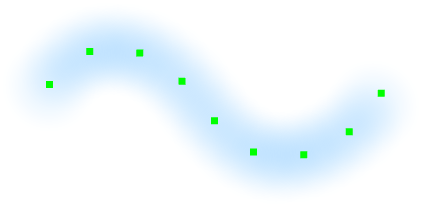
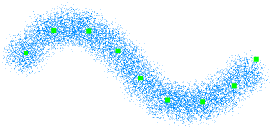
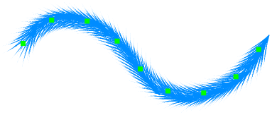
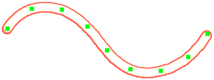
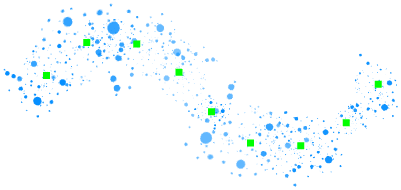

---
hide:
  - toc
---

<!-- https://steamcommunity.com/sharedfiles/filedetails/?id=2971097775 -->

"曲线画笔" 工具允许您稍后修改画笔笔触  
您可以通过单击和移动控制点来修改画笔笔划  
您还可以修改画笔参数

按住 Shift 并单击左右移动控制点, 可以更改控制点位置的笔压

|  | 如何使用 |
| ------ | ----------- |
| 移动控制点       | 单击并拖动控制点 |
| 控制点应该是尖锐的还是平滑的曲线 | Ctrl + 单击控制点 |
| 在保持曲线形状的同时移动曲线     | Shift + Alt + 单击并拖动 |
| 围绕点击位置旋转曲线             | Ctrl + Shift + Alt + 单击并向左或向右拖动 |

---

・ RGBA (0, 140, 255, 255)  
・ 较软  
・ 间距 20  
・ 大小 50  
・ 不透明度 10%

---

・ RGBA (0, 140, 255, 255)  
・ 画笔圆形图像 (img.tga)  
・ 间距 30  
・ 大小 35  
・ 不透明度 100%  
・ 随机角度 179°

---

・ RGBA (0, 140, 255, 255)  
・ 画笔圆形图像 (fur.tga)  
・ 间距 7  
・ 大小 30  
・ 不透明度 100%  
・ 沿画笔笔划旋转

---

・ RGBA (255, 77, 77, 255)  
・ 坚硬  
・ 间距 3  
・ 大小 9  
・ 不透明度 100%

双重画笔

・ RGBA (104, 255, 172, 255)  
・ 柔软  
・ 添加(发光)  
・ 间距 3  
・ 大小 8  
・ 不透明度 80%

---

・ RGBA (0, 140, 255, 255)  
・ 画笔圆形图像 (splatter.tga)  
・ 间距 35  
・ 大小 35  
・ 不透明度 100%  
・ 随机大小 120  
・ 随机不透明度 50%  
・ 随机角度 179°

---

・ RGBA (255, 0, 0, 255)  
・ 画笔圆形图像 (star.tga)  
・ 间距 8  
・ 大小 10  
・ 不透明度 100%  
・ 随机大小 110  
・ 随机位置 250  
・ 随机角度 179°

双重画笔

・ RGBA (255, 255, 0, 255)  
・ 画笔圆形图像 (star.tga)  
・ 添加(发光)  
・ 间距 8  
・ 大小 7  
・ 不透明度 100%  
・ 随机大小 110  
・ 随机位置 250  
・ 随机角度 179°
