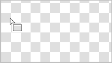
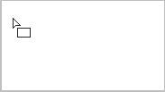
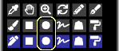
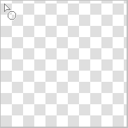
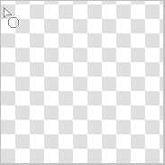
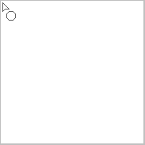
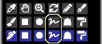
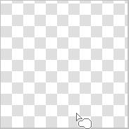
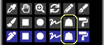

---
hide:
  - toc
---

<!-- https://steamcommunity.com/sharedfiles/filedetails/?id=2967680886 -->

您可以通过单击 "工具选择" 窗口中的 ■ 按钮来选择 "矩形" 工具

用 RGBA (44,134,245,150) 绘画的例子

选中 __"圆角"__ 并设置为 60 % 的绘画示例

启用 __"框"__ 复选框的绘画示例

如果选中 __"纵横比"__ 复选框, 则可以固定矩形的高度和宽度的比例  
如果选中 __"px"__ 复选框, 则可以以 px 为单位指定矩形的高度和宽度

### "圆形" 工具

用 RGBA (44,134,245,150) 绘画的例子

选择 "较软" 单选按钮的绘画示例

选中 __"椭圆"__ 并将其设置为 40 的绘画示例

选择 "较软" 单选按钮的绘画示例

### "套索" 工具

没有模糊的绘画示例 (RGBA (44,134,245,255))

使用模糊 15x15 px 绘制的示例 (RGBA (44,134,245,150))

启用 __"可视化模式(柳叶笔)"__ 复选框的绘画示例 (模糊 3x3 px)

### "多边形" 工具

使用 "多边形" 工具, 点击的位置成为多边形的顶点  
您最多可以撤消一个

---

所有这些绘画方法也可以在 __"混合模式"__ 中进行绘画。  
例如, 您可以通过使用 "正片叠底" 混合模式进行绘画来使其变暗。  
此外, 例如, 您可以通过在混合模式 "添加(发光)" 中用发白的黄色绘制它来使其更亮
