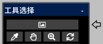

---
hide:
  - toc
---

<!-- https://steamcommunity.com/sharedfiles/filedetails/?id=2966625601 -->

通过在 "参考图像" 窗口中打开图像, 您可以将图像与画布分开显示  
您可以在创建插图时将其用作参考

您可以通过单击 __"工具选择"__ 按钮自由移动参考图像  
您还可以在 "工具选择" 窗口中为参考图像选择工具

