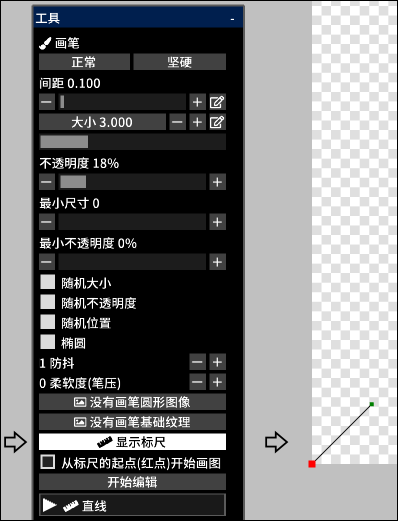

---
hide:
  - toc
---

<!-- https://steamcommunity.com/sharedfiles/filedetails/?id=2969758719 -->

您可以沿标尺绘制画笔笔划

通过单击 __"显示标尺"__ 按钮, 标尺将显示在画布的左下方位置  
此标尺与矢量图层中的曲线具有相同的特征  
标尺中的红点是标尺的起点

当取消勾选 __"从标尺的起点(红点)开始画图"__ 时, 画笔笔触将从画笔接触的位置与尺子之间的最短距离开始

通过单击 __"开始编辑"__ 按钮, 您将能够更改标尺的形状

|  | 如何使用 |
| ------ | ----------- |
| 选择控制点                       | 单击控制点 |
| 移动控制点                       | 单击并拖动控制点 |
| 删除控制点                       | Alt + 单击控制点 |
| 控制点应该是尖锐的还是平滑的曲线 | Ctrl + 单击控制点 |
| 在曲线的末端添加一个控制点       | 单击控制点以外的任意位置 |
| 在曲线中间添加一个控制点         | 单击曲线上的任意位置 |
| 在曲线的末端添加一个控制点(锐角) | Ctrl + 单击控制点以外的任意位置 |
| 在曲线中间添加一个控制点(锐角)   | Ctrl + 单击曲线上的任意位置 |
| 在保持曲线形状的同时移动曲线     | Shift + Alt + 单击并拖动 |
| 一起移动多个控制点               | Shift + 单击并拖动以将所有控制点移动到圆圈内 |
| 缩放曲线                         | Ctrl + Alt + 单击并向左或向右拖动 |
| 围绕点击位置旋转曲线             | Ctrl + Shift + Alt + 单击并向左或向右拖动 |

通过单击 __"完成编辑"__ 按钮, 您将能够再次使用画笔进行绘制
