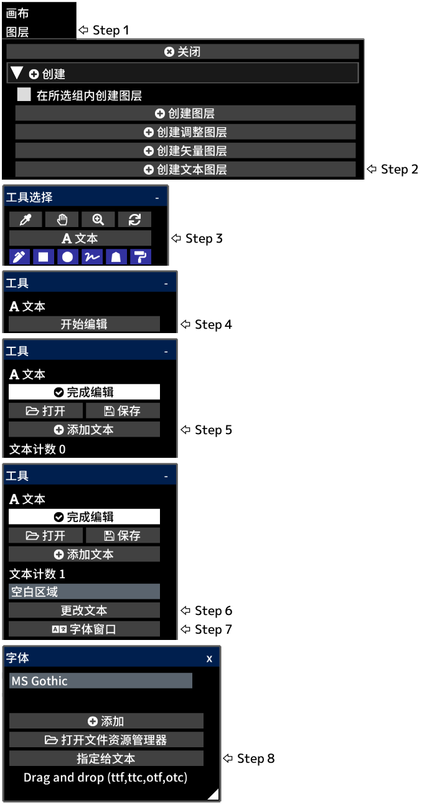

---
hide:
  - toc
---

<!-- https://steamcommunity.com/sharedfiles/filedetails/?id=2954849397 -->

文本创建在画布的左下角位置  
单击 __"完成编辑"__ 后, 将应用图层不透明度, 混合模式, 图层蒙版等

您可以通过单击"图层"菜单中的 __"栅格化图层"__ 按钮将文本图层转换为绘图图层
