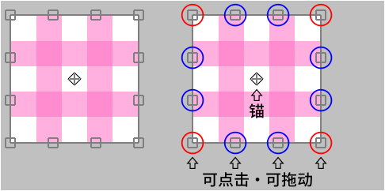
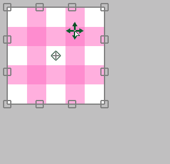
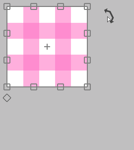
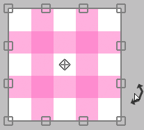
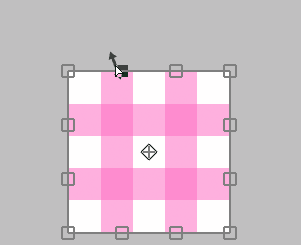
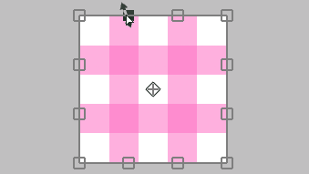
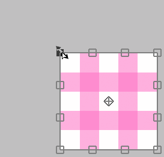
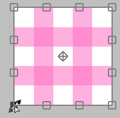
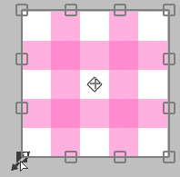

---
hide:
  - toc
---

<!-- https://steamcommunity.com/sharedfiles/filedetails/?id=2955702781 -->

### 如果光标在变换区域内

您可以通过单击自由移动它

您可以通过按住 Shift 键并单击仅水平或垂直移动它

### 如果光标在变换区域之外

您可以通过单击来旋转它

您可以通过按住 Ctrl 并单击来围绕锚点旋转它

### 如果光标在锚点上

您只能通过单击来移动锚

### 如果光标位于上,下,左或右边缘 ( □ )

您可以通过单击移动边缘

您可以通过 Alt + 单击同时移动两侧而不移动中心位置

您可以通过按住 Ctrl 并单击来自由移动边缘

您可以通过 Ctrl + Shift + 单击来沿其方向移动边缘

### 如果光标在4个顶点 ( □ )

您可以通过单击移动顶点

您可以使用 Alt + 单击缩放和旋转它

您可以通过 Shift + 单击来统一缩放它

您可以通过 Shift + Alt + 单击来统一缩放它而无需移动中心位置

---

您只能通过按住 Ctrl 并单击来自由移动顶点  
在这种情况下, 外观会以三种方式发生变化

#### Ctrl + 单击 "变换"

#### Ctrl + 单击 "透视变换" 并关闭 "透视"

#### Ctrl + 单击 "透视变换" 并关开 "透视"

您可以通过按 __"重置"__ 按钮返回到变换前的状态

* 变换(画布尺寸)
* 移动 缩放比例 旋转(画布尺寸)
* 透视变换
* 液化滤镜
* 修饰滤镜

这五个方法可以保存变换内容  
如果保存, 您可以将相同的变换应用到另一个图层

如果要通过指定数值进行变换, 请使用 __"移动 缩放比例 旋转"__  
例如, 如果您想将其缩小到 50 % 或将其旋转 45 度
