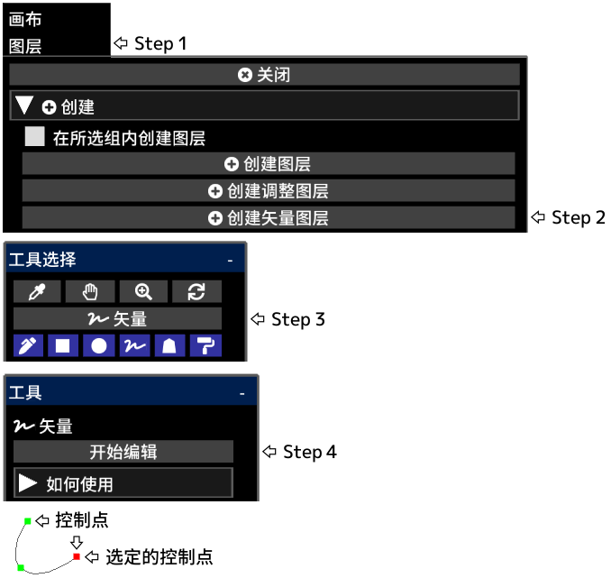

---
hide:
  - toc
---

<!-- https://steamcommunity.com/sharedfiles/filedetails/?id=2955213600 -->

单击 __"完成编辑"__ 后, 将应用图层不透明度, 混合模式, 图层蒙版等

您可以通过单击"图层"菜单中的 __"栅格化图层"__ 按钮将矢量图层转换为绘图图层

|  | 如何使用 |
| ------ | ----------- |
| 选择控制点       | 单击控制点 |
| 取消选择控制点   | Alt + 单击控制点以外的任意位置 |
| 移动控制点       | 单击并拖动控制点 |
| 删除控制点       | Alt + 单击控制点 |
| 控制点应该是尖锐的还是平滑的曲线   | Ctrl + 单击控制点 |
| 在曲线的末端添加一个控制点         | 在选中控制点的情况下单击控制点以外的任意位置 |
| 在曲线中间添加一个控制点           | 在选中控制点的情况下单击曲线上的任意位置 |
| 在曲线的末端添加一个控制点(锐角)   | 在选中控制点的情况下 Ctrl + 单击控制点以外的任意位置 |
| 在曲线中间添加一个控制点(锐角)     | 在选中控制点的情况下 Ctrl + 单击曲线上的任意位置 |
| 创建一个控制点作为另一条曲线       | 在未选择控制点的情况下单击控制点以外的任意位置 |
| 创建一个控制点作为另一条曲线(锐角) | 在未选择控制点的情况下 Ctrl + 单击控制点以外的任意位置 |
| 删除曲线 | 重复 Alt + 单击所有控制点, 或单击"删除曲线"按钮 |
| 在保持曲线形状的同时移动曲线 | 在选中控制点的情况下 Shift + Alt + 单击并拖动 |
| 复制曲线                     | 在选中控制点的情况下 Ctrl + Shift + 单击并拖动 |
| 一起移动多个控制点           | Shift + 单击并拖动以将所有控制点移动到圆圈内 |
| 缩放曲线                     | Ctrl + Alt + 单击并向左或向右拖动 |
| 围绕点击位置旋转曲线         | Ctrl + Shift + Alt + 单击并向左或向右拖动 |
